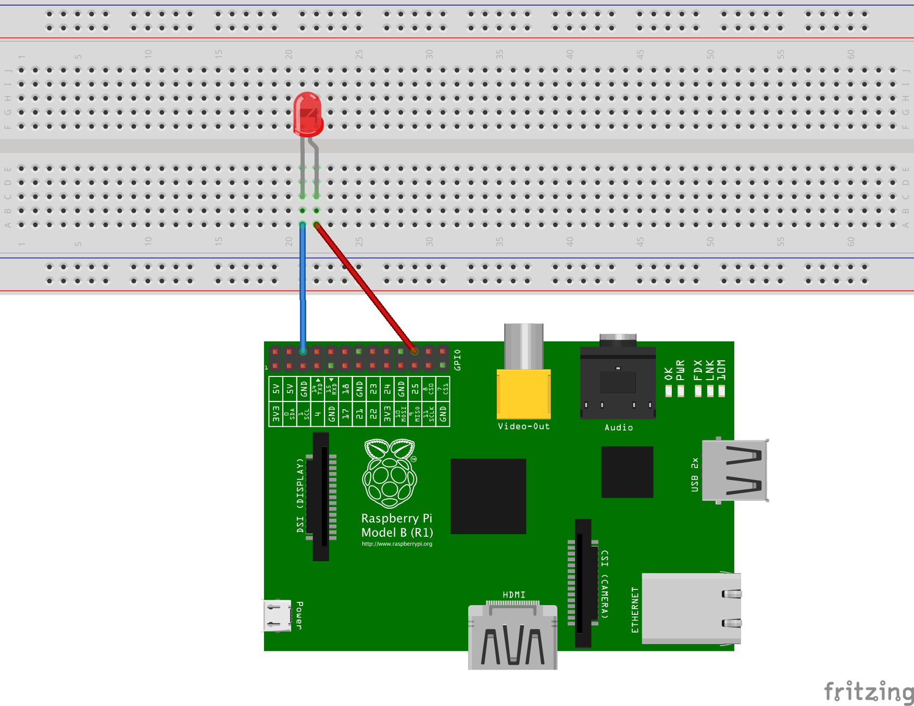

#SAKURAJIMA

##Features
 Turns The LED On When Sakurajima Volcano Erupts

##Platform
 Raspberry pi (Raspbian Debian Wheezy)

##Dependencies
 sudo gem install pi_piper  
 sudo gem install linkeddata  
 sudo gem install sparql  

##Install 
 git clone git@github.com:masa8/sakurajima.git

##Hardware Setup
 Pin 25 should go to the longer leg of LED.  
 Attach the shorter leg of the led to the ground.  

##Run
 sudo su  
 cd sakurajima  
 ruby sakurajima_checker.rb  

##Terms of use
 This source code is depend on a Sparql end point provided by AITC(http://api.aitc.jp).    
 If you want to use this source, please check AITC's terms of use.  
 Getting data by  their endpoint is trial use only.  

##License
 MIT

  

