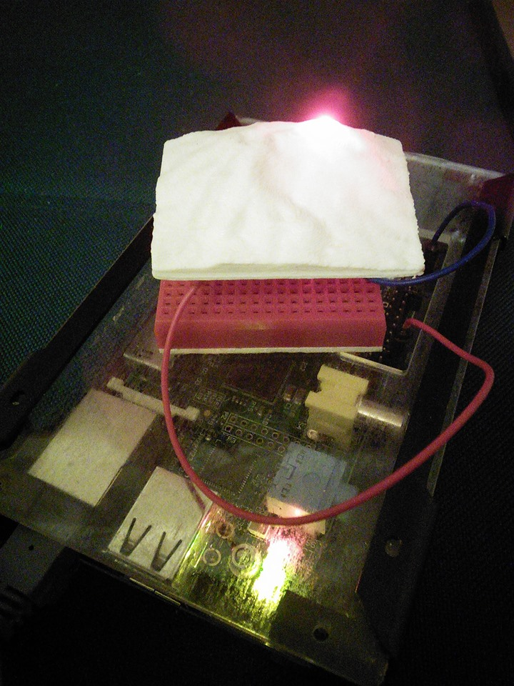

#SAKURAJIMA

##Features
 Turns The LED On When Sakurajima Volcano Erupts

##Platform
 Raspberry pi (Raspbian Debian Wheezy)

##Dependencies
 sudo gem install pi_piper
 sudo gem install linkeddata
 sudo gem install sparql

##Install 
 git clone git@github.com:masa8/sakurajima.git

##Terms of use
 Using AITC API(http://api.aitc.jp) for getting data.
 If you want to use this source, please check AITC's terms of use.
 Getting data from their endpoint is trial use only.

  

